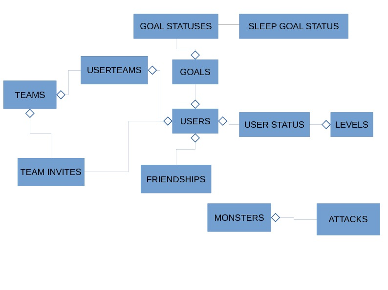
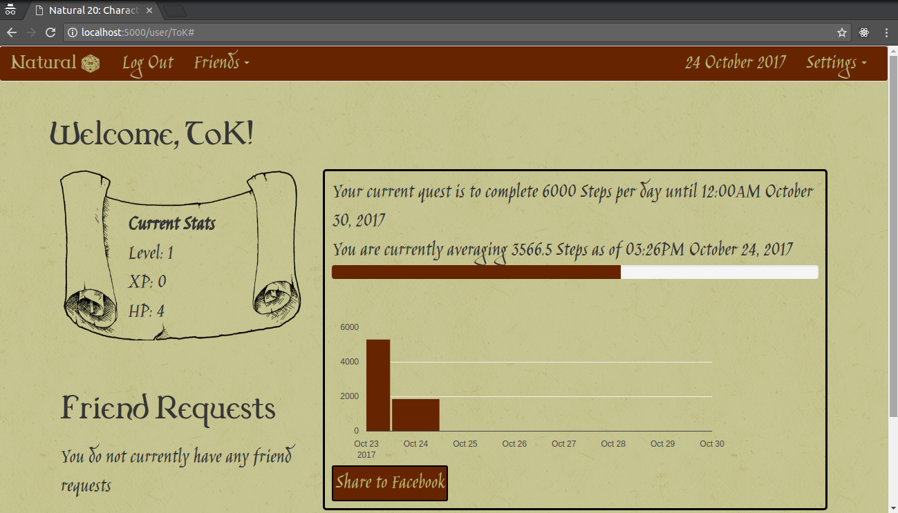
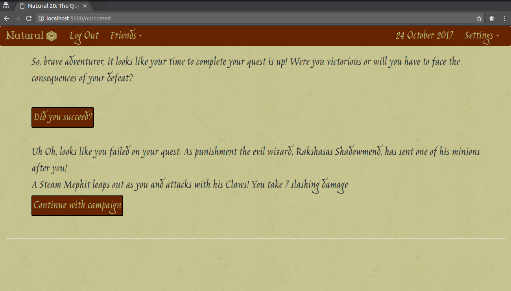

Natural 20
==============

.. image:: https://travis-ci.org/srhjne/Natural20.svg?branch=master
    :target: https://travis-ci.org/srhjne/Natural20
.. image:: https://coveralls.io/repos/github/srhjne/Natural20/badge.svg?branch=master
	:target: https://coveralls.io/github/srhjne/Natural20?branch=master

Description
--------------

Natural20 gamifies fitness tracking in the theme of dungeons and dragons. You can track Steps and Calories burned throught the Google fit API and track sleep data in the app. There is also a social aspect to the app allowing users to become friends with one another and also form teams.

Installation
--------------

This project is written in Python 2.7. To install the relevent python libraries run:
::

	pip install -r requirements.txt

This project requires a database called natural20

::

	createdb natural20

You can then seed this database by running:
::

	python seed.py

In order to run the server you need to obtain a Google API Client Key and Secret and load them into environment variables:
::

	export GGL_ID="YOUR_ID"

	export GGL_SECRET="YOUR_SECRET" 

You are then all set to run the server:
::

	python server.py

Database
---------------

The database used for this project is in PostgreSQL

    Schematic of the tables in the database

Website
----------------
Here is a brief tour of the website

The user page is here:

    User profile page

    Goal outcome page

